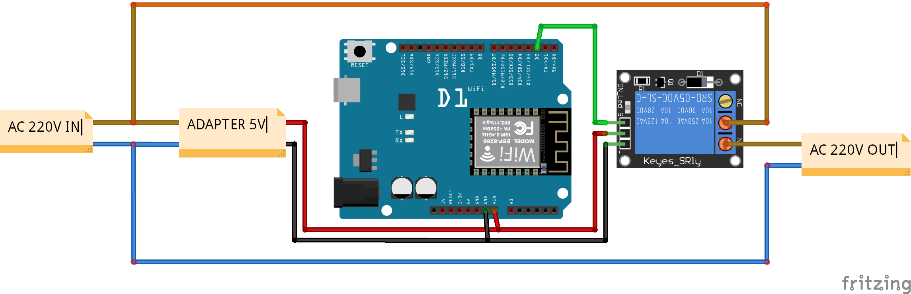
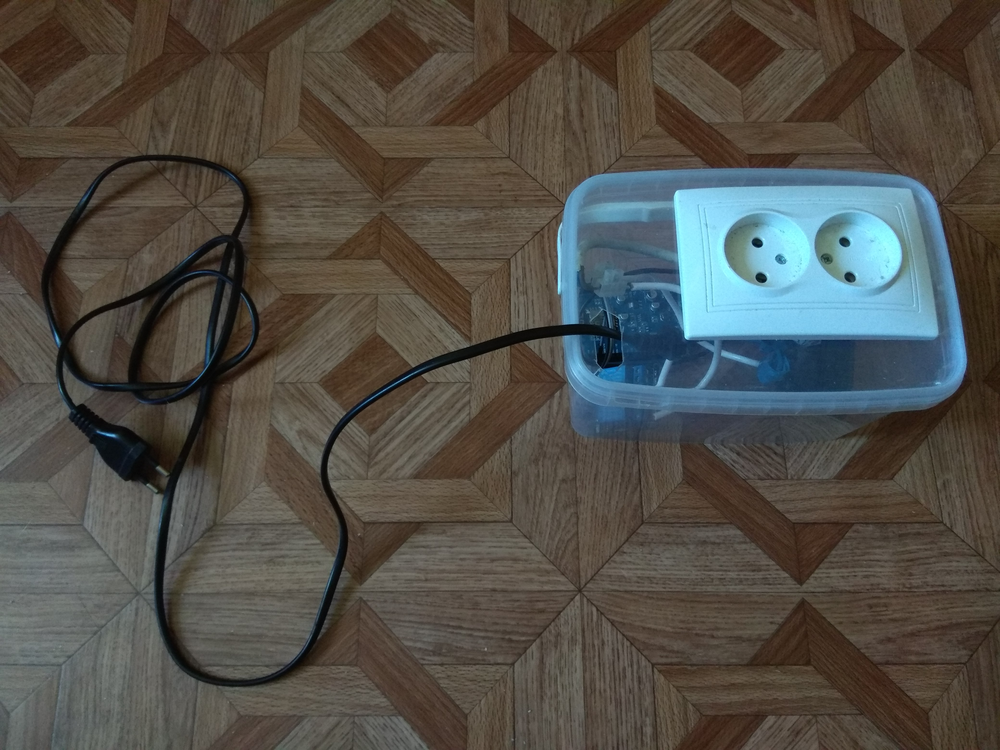
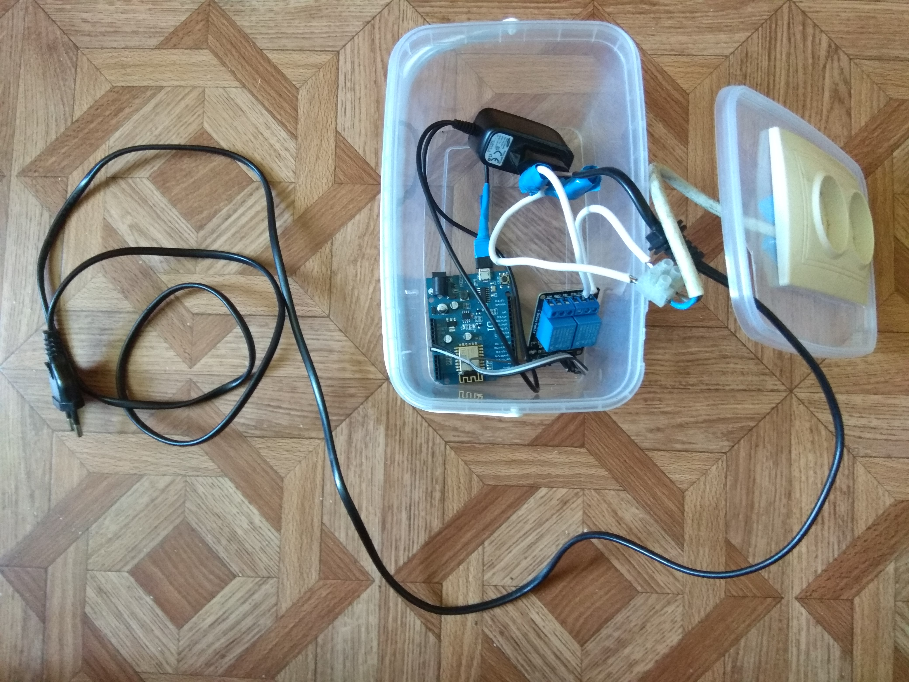
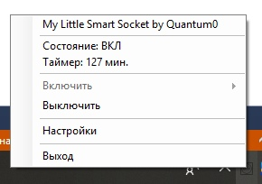
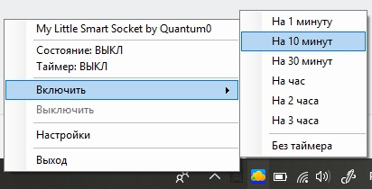
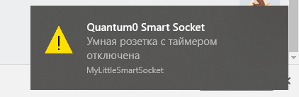
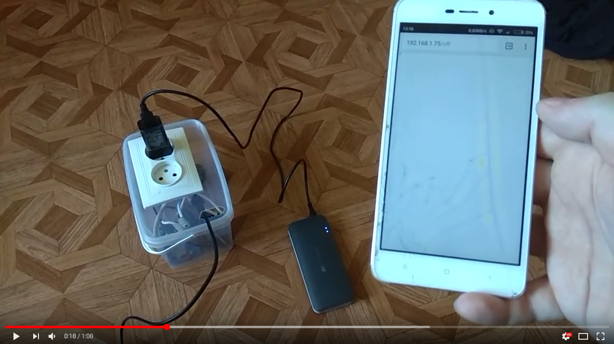

# My-Little-Smart-Socket

Управляемая через Wi-Fi розетка с таймером на основе Arduino

## Цель и описание работы

Иногда возникают ситуации, когда необходимо обеспечить напряжение в сети для конкретного устройства в строго определённое время, на определённый период. Например, такие устройства как ноутбук и смартфон рассчитаны на зарядку в течение нескольких часов (около 3). Если оставлять устройство на зарядке на более длительный период времени в течение долгого времени, аккумулятор устройства будет иметь более быструю тенденцию к деградации, т.е. к падению ёмкости. Иногда смартфон может использоваться в течении всего дня, а на ночь быть поставлен на зарядку. Иногда владелец может просто напросто забыть снять свой гаджет с зарядки. Для избежания этого и увеличения срока службы было изготовленно данное устройство. Оно позволяет оставлять свой гаджет на зарядке и не опасаться забыть о нём, или же просто оставлять на ночь. Через установленный период времени розетка сама автоматически отключит питание и телефон перестанет заряжаться. Так же данная розетка может быть удобна благодаря возможности управления через Wi-Fi с помощью простого REST API. Данная розетка может использоваться например для подключения освещения, что позволить контролировать его удалённо с помощью телефона или ноутбука. Мощность оборудования, которую способно контролировать данное устройство определяется максимальным пропускаемым током установленного реле. На данный момент данное устройство используется именно для того, чтобы оставлять на ночь телефоны на зарядку, не боясь за их аккумулятор.

## Планы развития

* Зуммер - подключить звуковой индикатор, который будет сигнализировать об окончании зарядки (выключении по таймеру)
* Индикатор - индикатор, показывающий оставшееся время таймера
* Установка названия сети - возможность установить название Wi-Fi сети, к которой должно подключатся устройство (на данный момент SSID жёстко прописан в коде)
* Определения когда было подключено устройство - включение таймера в тот момент, когда в розетку был воткнут адаптер для зарядки, остановка таймера, когда зарядное устройство было удалено

## Использование

Устройство подключается к Wi-Fi сети и в дальнейшем управляется по IP адресу 192.168.1.75 с помощью следующих медотов REST API:
* /on
* /off
* /on?timer=X, где X - количество минут
* /status
* /defaults?timer=X&state=Y, где X - количество минут, в течении которых розетка будет включена изначально при включении устройства в сеть, Y - начальное состояние (1 - включена, 0 - выключена). Если таймер установлен в 0 - розетка будет под напряжением до вызова метода /off

## Скриншоты

### Схема устройства

### Фото

### Скриншоты Desktop-клиента

### Видео демонстрация работы

## Ссылки на элементы Fritzing

https://github.com/mikeipin/Fritzing-Part-WeMos-D1-R2

https://github.com/rwaldron/fritzing-components
